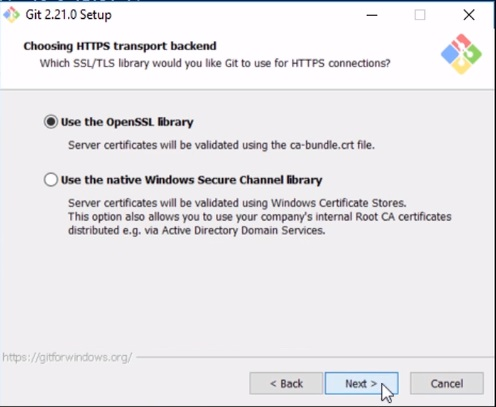

# Git - Platzi

<div align="center">
  
  <h5 style="font-weight:bold;" >Git & GitHub by aomine</h5>
</div>

## Index

- [1. Introducción](#introducción)
  - [¿Qué es Git?](#qué-es-git)
  - [¿Porqué usar Git?](#porqué-usar-git)
  - [Instalar Git en Windows](#instalar-git-en-windows)
  - [Archivos binarios y de texto plano](#archivos-binarios-y-de-texto-plano)
  - [Terminal y linea de comandos](#terminal-y-linea-de-comandos)
- [2. Comandos básicos de git](#comandos-básicos-de-git)
  - [Notas](#notas)
  - [git init](#git-init)
  - [git add](#git-add)
  - [git status](#git-status)
  - [git commit](#git-commit)
  - [git log](#git-log)
  - [git checkout](#git-checkout)
  - [git branch](#git-branch)
  - [Ramas](#ramas)
  - [Merge](#merge)
  - [git config](#git-config)
  - [git show](#git-show)
  - [git diff](#git-diff)
  - [git reset](#git-reset)
  - [git rm](#git-rm)
- [3. Flujo de trabajo básico](#flujo-de-trabajo-básico)
  - [git clone](#git-clone)
  - [git push](#git-push)
  - [git fetch](#git-fetch)
  - [git merge](#git-merge)
  - [git pull](#git-pull)
- [4. Trabajando con repositorios remotos](#trabajando-con-repositorios-remotos)
  - [git remote](#git-remote)
  - [SSH](#SSH)
  - [alias](#alias)
  - [git tag](#git-tag)
  - [gitk](#gitk)
- [5. Flujo de trababo profesionales](#flujo-de-trababo-profesionales)
  - [Pull Request](#pull-request)
  - [Fork](#fork)
  - [Git Ignore](#git-ignore)
  - [Readme](#readme)
  - [GitHub Pages](#github-pages)
- [6. Multiples entornos de trabajo](#multiples-entornos-de-trabajo)
  - [Git Rebase](#git-rebase)
  - [Git Stash](#git-stash)
  - [Git Clean](#git-clean)
  - [Git cherry-pick](#git-cherry-pick)
- [7. Comandos en Git para casos de emergencía](#comandos-en-git-para-casos-de-emergencía)
  - [Amend](#amend)
  - [Reflog](#reflog)
  - [Reset](#reset)
  - [Grep](#grep)
  - [Log](#log)
- [8. Bonus](#bonus)
  - [Saber cuantos commits hizo cada colaborador](#saber-cuantos-commits-hizo-cada-colaborador)
  - [Saber quien tienen la culpa](#saber-quien-tienen-la-culpa)

## Introducción

### ¿Qué es Git?

#### Es un control de versiones que guarda los cambios realziados en los archivos de tu proyecto.

<div align="center">
  
</div>

#### Ademas manejas los cambios que otras personas hagan sobre los mismos archivos, así multiples personas pueden trabajar en un mismo proyecto sin pisarse.

<div align="center">
  
</div>

#### Si existe algun error se peude saber quien hizo ese cambio.

<div align="center">
  
</div>

#### Si hay algo de una versión antigua que quieres recuperar  lo puedes hacer de manera precisa.

<div align="center">
  
</div>

#### En tu maquina local usas git funciona en la terminal o linea de comandos.

<div align="center">
  
</div>

#### Y tiene distintos comandos.

<div align="center">
  
</div>

#### Si quieres

* Colaborar con otros
* Usar una interfaz web
* Publicar tus proyectos en la web

#### Usas GitHub

<div align="center">
  
</div>

<div align="right">
  <small><a href="#index">🡡 volver al inicio</a></small>
</div>

### ¿Porqué usar Git?
Usamos Git solo para cambiar los cambios realizados en un archivo.

* Donde ocurrieron
* Cuando ocurrieron
* Quien los hizo
* Poder vovler a ellos

Git fue creado por la fundación Linux principalmente por Linus Torbal y es el sistema que maneja el kernel de linux.

<div align="right">
  <small><a href="#index">🡡 volver al inicio</a></small>
</div>

### Instalar Git en Windows

Asegurate de instalar git bash here 

<div align="center">
  
</div>

Para una fuente suave en la linea de comandos

<div align="center">
  
</div>

Cambiar el editor visual por defecto de git

<div align="center">
  
</div>

Estas opciones tienen que ver con que windows no es un entorno amigable para programadores.

Git se encarga de instala git bsah para hacernos la vida más facil (sololo podremos usar git en git bash)

<div align="center">
  
</div>

Pero tambien podemos usar git desde la linea de comandos nativa de windows y de terceros (git bash)

<div align="center">
  
</div>

EL tipo de libreria que queremos usar para la seguridad

OpenSSL es una libreria nativa de Linux y Unix para que toda tu información este cifrada y protegida pero esta no esta instalada por defecto en windows

Pero windows tiene sus propias librerias con la que manejas la seguridad a nivel de microsoft.

<div align="center">
  
</div>

Windows y Linux manejan el enter de forma distinta, ahora se nos presentan 3 opciones

* nos encargamos nosotros
  * se reciben los enter al estilode windows y cuando se envian al repositorio se convierten a la manera de linux
* te encargas tú
  * Como este en el sistema operativo
* se lo dejamos a una fuerza superior xd
  * no se realizan conversiones

La primera versión te hace más comptible con todo el mundo :)

<div align="center">
  
</div>

Ahora te pregunta si quieres usar su emluador de linux (MinTTY) o la consola por defecto de windows

<div align="center">
  
</div>

3 opciones más
* File system caching
  * Guardar todo en un cache del sistema
* Git Credentials Manager
  * Una forma en la que se manejan y se guardan las llaves privadas de git pero en el entorno de windows 
* Symbolic Links
  * Es como los accesos directos de windows pero que funciona en linux

<div align="center">
  
</div>

<div align="right">
  <small><a href="#tabla-de-contenido">🡡 volver al inicio</a></small>
</div>

### Archivos binarios y de texto plano

Los archivos de texto plano se muestran tal cual como se ven y puede ser abierto por editores de textos mientras que los archivos binarios estan estructuradas en ceros y unos en este caso word lo entiende y lo muestra graficamente mientras que uneditor de texto no lo entiende.

En el mundo de got lo que nosotros vamos a poder editar es texto plano.

<div align="right">
  <small><a href="#index">🡡 volver al inicio</a></small>
</div>

### Terminal y linea de comandos

Lo primero que hay que entender es la diferencia de estructura de archivos entre windows y linux

* pwd
  * Muestra la ruta actual
* cd (change directory)
  * Movernos entre los directorios
  * si se nos muestra un ~ → nos encontramos en user
  * si se nos muestra un / → nos encontramos en la raiz del disco
  * cd ../ para salir del directorio 
  * cd / → para ir a la raiz de mi disco
  * cd → para ir a mi usuario 
  * echo cd RUTA >> ~.bashrc
* ls
  * mostros todos los archivos del directorio
  * ls -l → mostrar todos los archivos y que me los muestre en una lista
  * ls -a → mostrar todos los archivos incluidos los ocultos
  * ls -al → mostrar todos los archivos incluidos los ocultos y que me los muestre en una lista
* clear
  * limpiar la consola
  * tambien podemos usar ctrl + l
* Windos no es sensible a mayusculas puedes ingrear a User com cd User o cd user (esto no es así en mac o linux)
* tab
  * te autocompleta la sentencia cd u + tab → cd Users/
* mkdir (make directory)
  * para crear una carpeta
* touch
  * para crear un archivo
* cat
  * para ver el contenido de un archibo de texto plano
* history
  * para ver el historial de comandos
* !NUMERO_DEL_COMANDO
  * para ejecutar ese comando
* rm (remove)
  * remover archivos
  * rm -r → para borrar directorios 
* COMANDO --help
  * ver la lista de parametros para cada comando

<div align="right">
  <small><a href="#index">🡡 volver al inicio</a></small>
</div>

## Comandos básicos de git

### Notas

#### -

Se usa un solo guión cuando vas a usar solo las letras (atajos) -m

#### --

Usar el doble guion significa que vas a usar una palabra como --global

#### <ESC> + :wq

Para salir de lugares raros :v

<div align="right">
  <small><a href="#index">🡡 volver al inicio</a></small>
</div>

### git init

Suceden 2 cosas

* Se crea un area en memoria ram que se llama staging donde se iran agregando los cambios.
* Se crea el repositorio ( la carpeta .git) y es donde  van a estar todos los cambios al final de tu proyecto.

<div align="right">
  <small><a href="#index">🡡 volver al inicio</a></small>
</div>

### git add

#### git add <FILE_NAME> or .

Una vez haces cambios en tus archivos se agregan al staging area usando el comando git add . todos los archivos modificados pasan a vivir en staging donde esperan a que se envie al repositorio.

Antes de ejecutar el comando los archivos no son rastreados (untracked) y no estan el staging y una vez se ejecute el comando estos pasan a ser rastreados (tracked) y pasan a estar en staging

<div align="right">
  <small><a href="#index">🡡 volver al inicio</a></small>
</div>

### git status

Para saber que archivos estan el staging

<div align="right">
  <small><a href="#index">🡡 volver al inicio</a></small>
</div>

### git commit

Todos los archivos modificados y que vivian en staging pasan al repositorio por defecto llamado master.

Los números raros que salen en cada commit son el id en la base de datos.

Cada commit enviado al repositorio es una nueva versión de cambios de tu proyecto v1, v2, v3... vn.

Al usarlo se nos abrira una pantalla rara que es un editor de codigo dentreo del mundo de git llamado vim

#### git commit -m "MESSAGE"

Para poder agregarle un mensaje a tu commit (es lo más recomendable)

#### git commit -a

esto atuomaticamente hace el git add de los cambios __Solo funciona con archivos que ya estabam el staging previamente__ si creo un archivo nuevo esto no va a funcionar.

#### git commit -am "MESSAGE"

juntamos los 2 comandos anteriores

<div align="right">
  <small><a href="#index">🡡 volver al inicio</a></small>
</div>

### git log

Para ver todo el historial de commits

#### git log --stat

vamos a poder ver los cambios especificos de los archivos en cada cmommit 

#### git log --all

Te muestra todo el historial de tus commits

##### git log --all -graph

Te muestra todo el historial de tus commits con un gráfico

###### git log --all -graph --decorate --oneline

Te muestra todo el historial de tus commits con un gráfico y comprimido

#### :q

Para salir del log

<div align="right">
  <small><a href="#index">🡡 volver al inicio</a></small>
</div>

### git checkout

#### git checkout -- <FILE_NAME>

Para eliminar los cambios que no se han subido la staging

#### git checkout <COMMIT_ID>

Puedes traer las distinas versiones (commits) hacia tu carpeta.

#### git checkout <COMMIT_ID> <FILE_NAME>

Puedes traer las distinas versiones (commits) hacia tu carpeta pero solo de el archivo especifico.

#### git checkout <BRANCH_NAME>

Te permite moverte entre distintas ramas.

#### git checkout -b <BRANCH_NAME>

Te ptermite crear y moverte a la rama nueva.

<div align="right">
  <small><a href="#index">🡡 volver al inicio</a></small>
</div>

### git branch

Te muestra las ramas existentes

#### git branch <BRANCH_NAME>

Te permite crear una rama

#### git branch -d <BRANCH_NAME>

Te perimte eliminar una rama, pero solo si esta no contiene trabajos sin fucionar

Si se esta trabajando con un repositorio remoto entonces se tiene que hacer un push

```
git push -u origin :<BRANCH_NAME>
```

#### git branch -D <BRANCH_NAME>

te permite forzar la eliminacion de la rama

Si se esta trabajando con un repositorio remoto entonces se tiene que hacer un push

```
git push -u origin :<BRANCH_NAME>
```

#### git branch -r

Te permite ver tus ramas remotas(las de tu repositorio remoto)

#### git branch -a

Te permite ver tus ramas y tus ramas remotas

<div align="right">
  <small><a href="#index">🡡 volver al inicio</a></small>
</div>

### Ramas

Por defecto tu estas en una rama master con sus distintas versines (commits)

```
Master      v1      →     v2      →     v3    →     v-actual
```

Pero ahora decidimos hacer algunos experimentos pero no queremos tocar el código actual asi que creamos una rama llamada Development teniendo como base la v3 del proyecto.

```
Master      v1      →      v2      →      v3      →      v-actual

                                          ↓ 

Development                               v1     →      v2      →      v3
```

La rama Development se convirtio en algo completamente distinto a la de master

Ahora digamos que estabas cambiando cosas y salio un bug en la versión actual por lo cual creas una rama especial partiendo de la versión actual de la rama master.


```
Master      v-actual

                ↓

HotFix         v1      →     v2
```

Ahora que ya solucionaste el bug en otra rama es momento de llevar esos cambios a la versión actual en la rama master

<div align="right">
  <small><a href="#index">🡡 volver al inicio</a></small>
</div>


### Merge

Ahora que ya tienes la versión de HotFix en Master se creo una nueva versión que llamaremos versión final

```
Master      v-actual        v-final

                ↓             ↑

HotFix         v1      →     v-fix
```

Pero ahora ya terminaste tus experimentos y quieres unirlos a la versión final en la rama master

```
Master          v-final     →     v-final-final

                  ↑

Development     v-final
```

Pero juntar 2 ramas puede romper con el código y a esto se le llama conflicto.

<div align="right">
  <small><a href="#index">🡡 volver al inicio</a></small>
</div>

### git config

Te mostrara una lista de como usarlo

#### git config --list (-list)

Te mostrara la configuración de tu git

#### git config --list --show-origin

Podras ver donde estan guardadas las configuraciones de windows

#### git config --global

Para cambiar la configuración global de git

##### git config --global user.name "NAME"

Para cambiar el usuario de la configuración global

##### git config --global user.email "EMAIL"

Para cambiar el email de la configuración global

#### git config --global ailas.ALIAS "COMAND WITHOUT GIT (commit)"

crear alias para un comando de git

<div align="right">
  <small><a href="#index">🡡 volver al inicio</a></small>
</div>

### git show

Te muestra todos los cambios de tu proyecto entre el commit actual y el anterior

#### git show <FILE_NAME>

Te muestra todos los cambios de un archivo entre el commit actual y el anterior

#### git show-ref --tags

Te muestra los tags con su hash

#### git show-branch

Te muestra la historia de tus ramas

#### git show-branch --all

Te muestra la historia de tus ramas pero con más detalles

<div align="right">
  <small><a href="#index">🡡 volver al inicio</a></small>
</div>

### git diff

Te muestra los cambios entre tus archivos locales y lo que este en staging (los que estan siendo rastreados, que se les hizo como minimo 1 git add)

#### git diff <COMMIT_ID> <COMMIT_ID>

Te muestra todos los cambios entre los distintos commit

<div align="right">
  <small><a href="#index">🡡 volver al inicio</a></small>
</div>

### git reset 

#### git reset --hard

Para volver en el tiempo borrando absolutamente todo lo que este por adelante del punto al cual deseamos volver

#### git reset --soft

Similiar a --hard pero mantenemos lo que este en staging

#### git reset HEAD <FILE_NAME>

Elimina todos los archivos que se esten rastreando en el staging

<div align="right">
  <small><a href="#index">🡡 volver al inicio</a></small>
</div>

### git rm

No se puede usar sin más tiene que tener un flag

#### git rm --cached <FILE_NAME>

Elimina los archivos del área de Staging y del próximo commit pero los mantiene en nuestro disco duro.

Funciona similiar a git reset HEAD

#### git rm --force <FILE_NAME>

Elimina los archivos de Git y del disco duro de los archivos que esten en staging. Git siempre guarda todo, por lo que podemos acceder al registro de la existencia de los archivos, de modo que podremos recuperarlos si es necesario (pero debemos usar comandos más avanzados).

<div align="right">
  <small><a href="#index">🡡 volver al inicio</a></small>
</div>

## Flujo de trabajo básico

Antes que nada se necesita un repositorio remoto puede ser github, gitlab, bitbucket el que quieras

### git clone

#### git clone <REPOSITORY_URL>

Se trae lor archivos a dos lugares, una copia del master a tu directorio local y crea la base de datos de todos los cambios historicos en el repositorio local y deja staging limpio.

<div align="center">
  
</div>


<div align="right">
  <small><a href="#index">🡡 volver al inicio</a></small>
</div>

### git push

Envio todos mis commits de mi repositorio local al servdior remoto

<div align="center">
  
</div>


#### git push <REMOTE | origin por lo general> <BRANCH_NAME | master por lo general>

Comando pra enviar al repositorio remoto los commits de mi rama especifica

#### git push <REMOTE | origin por lo general> --tags

Para enviar los tags

#### git push <REMOTE | origin por lo general> :refs/tags/<TAG_NAME>

Para eliminar un tag en el repositorio remoto

<div align="right">
  <small><a href="#index">🡡 volver al inicio</a></small>
</div>

### git fetch

Te trae los nuevos commits del repositorio remoto al repositorio local pero NO los trae a nuestro directorio de trabajo local

<div align="center">
  
</div>


<div align="right">
  <small><a href="#index">🡡 volver al inicio</a></small>
</div>

### git merge

Para que se copie en nuestro directorio de trabajo local tengo que fucionar los ultima versión que esta en el repositorio local con mi versión actual (la de mi directorio de trabajo local)

<div align="center">
  
</div>

#### git merge <BRANCH_NAME>

Te permite unir 2 ramas

<div align="right">
  <small><a href="#index">🡡 volver al inicio</a></small>
</div>

### git pull

Ejecuta fetch y merger a la vez para traer los ultimos cambios en el repositorio remoto y combinarlos con nuestro repositorio global y directorio global en un solo paso

<div align="center">
  
</div>


#### git pull <REMOTE | origin por lo general> <BRANCH_NAME | master por lo general>

Para poder subitr los commits al repositorio remoto

#### git pull <REMOTE | origin por lo general> <BRANCH_NAME | master por lo general> --allow-unrelated-histories

Para poder subitr los commits al repositorio remoto de manera forzada

<div align="right">
  <small><a href="#index">🡡 volver al inicio</a></small>
</div>

## Trabajando con repositorios remotos

### git remote 

Nos muestra los remotes existentes

#### git remote add origin <NEW_URL>

Para poder agregar la url del repositorio remoto de donde nos traeremos los cambios y hacia donde enviaremos nuestros cambios

#### git remote -v

Nos muestra vervalmente los remotes existentes

#### git remote rm <REMOTE_NAME>

Nos permite eliminar un remote

#### git remote set-url <REMOTE_NAME> <NEW_URL>

Nos permite cambiar la url remota

<div align="right">
  <small><a href="#index">🡡 volver al inicio</a></small>
</div>

### SSH

#### ssh-keygen -t rsa -b 4096 -C "COMMENTS"

Generar llave publica y privada

#### eval $(ssh-agent -s)

Comprobar si el sistema de cifrado está activo

#### ssh-add <SECRET_KEY_ROUTE>

Informar al sistema la ubicación de nuestra llave privada

<div align="right">
  <small><a href="#index">🡡 volver al inicio</a></small>
</div>

### alias

te muestra los alias creados

#### alias <ALIAS_NAME>="COMAND"

crear un alias para un comando

<div align="right">
  <small><a href="#index">🡡 volver al inicio</a></small>
</div>

### git tag

Te muestra los tags

#### git tag -a <TAG_NAME> -m "MESSAGE" <COMMIT_ID>

Agregar un tag

#### git tag -d <TAG_NAME>

Eliminarar un tag

<div align="right">
  <small><a href="#index">🡡 volver al inicio</a></small>
</div>

### gitk

nos abre un gestor visual de las historias de git

<div align="right">
  <small><a href="#index">🡡 volver al inicio</a></small>
</div>

## Flujo de trababo profesionales

### Pull Request

Esta caracteristica no es de Git si no exclusiva de GitHub

Es un estado intermedio antes de hacer un merge, esto nos permite que nosotros y otros miembros del equipo puedan revisar los cambios o mejores del código y que este sea correcto y así ellos puedan aprobarlo antes de combinar las 2 ramas

<div align="right">
  <small><a href="#index">🡡 volver al inicio</a></small>
</div>

### Fork

Esta caracteristica no es de Git si no exclusiva de GitHub

Se usa cuando nos gusta mucho un proyecto del cual no somos parte

Nos permite hacer una copia del estado actua del proyecto y clonarlo como un proyecto mio

Esto solo se puede hacer con proyecto públicos

las ventajas de hacer un fork es que nos permite hacer un pull request con el proyecto original

Para mantenerse siempre actualizados e tiene 2 caminos

* Haciendo merge desde github
* Añadir un segundo remote hacia el proyecto original llamado upstream (recomendado) para hacer los pulls que matendran actualizado nuestro fork

<div align="right">
  <small><a href="#index">🡡 volver al inicio</a></small>
</div>

### Git Ignore

Es una buena práctica no subir archivos binarios a un repositorio remoto

Para lograrlo simplemente tenemos que crear un archivo .gitignore en la raiz de nuestro proyecto y escribir ahi todos los archivos que deseamos ignorar

<div align="right">
  <small><a href="#index">🡡 volver al inicio</a></small>
</div>

### Readme

Otra muy buena práctica es crear un archivo README.md en la razi de tu proyecto en la cual puedes describir y explicar de forma clara y precisa de lo que trata tu proyecto o incluso una documentación en la cual puedes indicar como usar tu proyecto

<div align="right">
  <small><a href="#index">🡡 volver al inicio</a></small>
</div>

### GitHub Pages

Es tan facil como

* ir a los settings de nuestro proyecto
* dirigirnos a la sección de github pages
* indicar que rama usara
* y listo tu proyecto ya esta online

Pero si quieres que este sea la raiz de tu cuenta el proyecto tiene que llaramrse <PROFILE_NAME>.github.io

<div align="right">
  <small><a href="#index">🡡 volver al inicio</a></small>
</div>

## Multiples entornos de trabajo

### Git Rebase

Significa que agarramos un rama externa completa y la pegamos a nuestra rama maestra, esto es una muy mala práctica eviandolas a repositorios remotos esto solo lo deberias hacer internamente (en local)

### git rebase <BRANCH_NAME | master>

Estando en la rama experimental ejecutamos el comando hacia la rama maestra.

Es importante hacer rebase primero a la rama que no deseamos y despues ejecutar rebase a la rama masestra

Una vez terminado el proceso de rebase eliminamos la rama experimental

<div align="right">
  <small><a href="#index">🡡 volver al inicio</a></small>
</div>

### Git Stash

Planteemos un nuevo escenario

Digamos que estoy en la rama master y realizamos modificaciones de toda la vida pero tambien una modifcación no deseada que rompe nuestro código y tengo que irme a una rama anterior para ver cual era el codigo que funciona pero obviamente no qiero hacerle add ni commit a esas modificaciones no deseadas pero quiero guardar las otras modicaciones en algún lugar y eso lo hacemos con stash

Tambien podemos hacer cambios en nuestro proyecto no guardarlos pero si guardarlos en el stash y crear una nueva rama y pegar ahi esos cambios manteniendo nuestro master

#### git stash

Guarda las modificaciones no guardadas y nos regresa a un commit anterior

##### git stash list

Nos muestra una lista de los stashs

##### git stash pop

Para volver a traer nuestras modificaiones no guardadas pero si guardadas en nuestro stsah

##### git stash branch <BRANCH_NAME>

Nos permite crear una nueva rama con el nombre indicado movernos a ella y pegar ahi los cambios que esten en stash

##### git stash drop

Nos permite eliminar los stash guardados

<div align="right">
  <small><a href="#index">🡡 volver al inicio</a></small>
</div>

### Git Clean

Es util cuando tenemos archivos que no son parte de nuestro directorio de trabajo y que no deberiamos agregar al repositorio local

Con el comando git clean podremos eliminar los archivos que aun no se an guardado en staging (esten siendo trackeados)

#### git clean --dry-run

Nos dara una lista de los elementos que se eliminaran

#### git clean -f

Eliminar todos los archivos de la lista, pero no eliminara las carpetas (SOLO archivos y carpetas no trackeadas) las carpetas tendras que eliminarlas a mano o con los comandos respectivos

<div align="right">
  <small><a href="#index">🡡 volver al inicio</a></small>
</div>

### Git cherry-pick

Se usa para traer commits de otras ramas a nuestra rama maestra sin hacer un merge completo de las 2 ramas

#### Git cherry-pick <COMMIT_HASH>

Nos trae el commit indicado a la rama en la que estemos

<div align="right">
  <small><a href="#index">🡡 volver al inicio</a></small>
</div>

## Comandos en Git para casos de emergencía

### Amend

Tenemos en mente realizar 2 cambios y supuestamente los realizamo  y hacemos el commit respectivo con el mensaje de los 2 cambios pero nos acordamos que se nos olvido uno de los cambios y lo haces pero no quieres hacer otro commit, ahi entra el siguiente comando

Antes de realizarnos tenemos que agregar los cambios con el git add <FILE_NAME> de toda loa vida si no lo haces no funcionara

#### git commit --amend

Nos permite insertar los cambios realizados y guardados en nuestro ultimo commit al hacerlo tendremos la opción de cambiar el mensaje de ese commit

y listo nadie se dara cuenta de tu error :v

<div align="right">
  <small><a href="#index">🡡 volver al inicio</a></small>
</div>

### Reflog

Procedemos a destruir el proyecto literalmente

* borramos el index.html
* nos vamos a header y hacemos merge con master
* y luego borramos header

#### git reflog

Nos muestra un historia de los comandos que hicimos en git

<div align="right">
  <small><a href="#index">🡡 volver al inicio</a></small>
</div>

### Reset

Ya que nuestro proyecto esta destruido tendremos que hacer algo para arreglarlo y lo lograremos con el siguiente comando

##### git reset --soft <REFLOG_HASH>

Te resetea hasta el punto del hash especificado pero te mantiene lo que tenias en staging

##### git reset --hard <REFLOG_HASH>

Te resetea absolutamente todo hasta el punto del hash especificado incluyendo lo que tengas en staging

<div align="right">
  <small><a href="#index">🡡 volver al inicio</a></small>
</div>

### Grep

Que pasa si nos interesa saber cuantas veces usasmos una palabra en nuestro proyecto

#### git grep <TEXT_TO_FIND> || "TEXT_TO_FIND" -> entre comillas si es una etiqueta

Nos muestra todos los lugares donde esta la palabra buscada

#### git grep -n <TEXT_TO_FIND>

Nos muestra todos los lugares donde esta la palabra buscada y en que linea se encuentra

#### git grep -n <TEXT_TO_FIND>

Nos muestra cuantas veces se repite la palabra buscada en cada archivo

<div align="right">
  <small><a href="#index">🡡 volver al inicio</a></small>
</div>

### Log

Pero que pasa si queremos ver todas las veces que usamos una palabra en el historial de commits

#### git log -S "TEXT_TO_FIND"

Nos muestra todos los commits donde se encuentra la palabra buscada

<div align="right">
  <small><a href="#index">🡡 volver al inicio</a></small>
</div>

## Bonus

### Saber cuantos commits hizo cada colaborador

#### git shortlog

Nos muestra un log por persona de lo que hizo cada colaborador

##### git shortlog -sn

Nos muestra las personas que hicieron ciertos commits y cuantos hicieron

##### git shortlog -sn --all

Nos muestra las personas que hicieron ciertos commits y cuantos hicieron hasta los que fueron borrados

##### git shortlog -sn --all --no-merges

Nos muestra las personas que hicieron ciertos commits y cuantos hicieron hasta los que fueron borrados pero sin los merges

Y ya que es muy largo es buena idea hacerle un alias

```
git config --global alias.stats 'shortlog -sn --all --no-merges'
```

<div align="right">
  <small><a href="#index">🡡 volver al inicio</a></small>
</div>

### Saber quien tienen la culpa

#### git blame <FILE_NAME>

Nos muestra que personas hicieron que cambios del archivo especifico

#### git blame -c <FILE_NAME>

Nos muestra que personas hicieron que cambios del archivo especifico pero con mejor identación

#### git blame -c <FILE_NAME> -L<NUMBER_OF_LINE>,<NUMBER_OF_LINE>

Nos muestra que personas hicieron que cambios del archivo especifico pero con mejor identación

#### git blame --help

Nos abrira el manual del comando que vivde dentro de nuestra computadora y funciona para todos los comandos de git

<div align="right">
  <small><a href="#index">🡡 volver al inicio</a></small>
</div>